# 🔵 BlueShare: Polyglot Bluetooth Network Sharing

> **When networks drop, share your packet with BlueShare**

A revolutionary Bluetooth-based network sharing service that transforms individual mobile connections into collaborative, cost-efficient group networks. Share internet access seamlessly across devices with transparent, real-time cost allocation.

## 🚀 What is BlueShare?

BlueShare enables "decentralized mesh WiFi piggybacking with Venmo-style payments" through:

- **📱 Bluetooth LE Networking** - Device discovery and mesh coordination
- **💰 Microtransaction Payments** - Fair, instant cost sharing via Lightning Network  
- **🔒 Privacy-First** - Zero-knowledge usage tracking with Node-Zero integration
- **🌐 Polyglot Support** - Works across Android, iOS, and Linux platforms

## ⚡ Quick Start

```bash
# Clone the repository
git clone https://github.com/obinexus/blueshare.git
cd blueshare

# Build for your platform
./scripts/build.sh

# Create a network
./scripts/create_network.sh --topology=star --duration=3600

# Join existing network  
./scripts/join_network.sh --network-id=<network_id>
```

## 🏗️ How It Works

```mermaid
graph LR
    A[Device A<br/>📱 Mobile Data] -->|Bluetooth LE| B[BlueShare Mesh]
    C[Device B<br/>💻 Laptop] -->|Bluetooth LE| B
    D[Device C<br/>📱 Phone] -->|Bluetooth LE| B
    B --> E[Shared Internet<br/>🌐]
    B --> F[Cost Sharing<br/>💳 Lightning Network]
```



### Network Topologies

- **⭐ Star**: Single host shares connection (3-5 devices)
- **🚌 Bus**: Daisy-chain with automatic failover
- **🕸️ Mesh**: Multiple hosts with load balancing (up to 10 devices)
- **🔄 Hybrid**: Dynamic switching based on conditions

## 💡 Key Features

### 📊 **Smart Cost Allocation**
```
Session Cost = (Data Usage MB × Cost per MB) + Session Fee
Fair Share = Total Cost ÷ Active Participants
```

### 🔐 **Privacy & Security**
- Zero-knowledge usage tracking
- Encrypted mesh communications
- Anonymous Lightning Network payments
- Constitutional compliance framework

### 🎛️ **Quality of Service**
- Real-time bandwidth monitoring
- Fair queuing with QoS prioritization
- Dynamic bandwidth allocation
- Automatic topology optimization

## 🛠️ Technical Stack

- **Core**: C11 with cross-platform abstraction
- **Mobile**: Android NDK + iOS SDK integration
- **Payments**: Lightning Network microtransactions
- **Privacy**: Node-Zero zero-knowledge framework
- **Threading**: GosiLang thread-safe communication

## 📱 Platform Support

| Platform | Status | API |
|----------|--------|-----|
| 🤖 Android | ✅ Ready | `BlueShareService.java` |
| 🍎 iOS | ✅ Ready | `BlueShareManager.swift` |  
| 🐧 Linux | ✅ Ready | `libblueshare.so` |

## 🎯 Use Cases

### 👨‍👩‍👧‍👦 **Family & Friends**
- Share mobile data during travel
- Cost-effective group connectivity
- Student study networks

### 🏢 **Business**
- Conference networking
- Remote team backup connectivity
- Field operations support

### 🌍 **Community**
- Neighborhood WiFi sharing
- Emergency response networks
- Rural connectivity extension

## 🚀 Getting Started

### Prerequisites
```bash
# Install dependencies
sudo apt install cmake build-essential libbluetooth-dev
# Or brew install cmake bluetooth-libs  # macOS
```

### Build & Test
```bash
# Configure build
mkdir build && cd build
cmake .. -DCMAKE_BUILD_TYPE=Release

# Build core library
make -j$(nproc)

# Run tests
make test
```

### Create Your First Network
```bash
# Host creates network
./blueshare_cli create-network \
  --topology=star \
  --cost-per-mb=100 \
  --duration=7200

# Clients join
./blueshare_cli join-network \
  --network-id=<network_id> \
  --role=client
```

## 📚 Documentation

- **[API Reference](docs/api/README.md)** - Complete API documentation
- **[User Guide](docs/user/README.md)** - End-user setup and usage
- **[Technical Specs](docs/technical/README.md)** - Architecture and implementation

## 🤝 Contributing

We welcome contributions! Please see:
- [Contributing Guidelines](CONTRIBUTING.md)
- [Code of Conduct](CODE_OF_CONDUCT.md)
- [Constitutional Compliance](docs/constitutional/README.md)

### Development Setup
```bash
# Fork and clone
git clone https://github.com/yourusername/blueshare.git

# Create feature branch
git checkout -b feature/amazing-feature

# Build and test
./scripts/build.sh debug
./scripts/test_all.sh

# Submit pull request
```

## 📄 License

This project operates under the OBINexus Constitutional Framework, ensuring:
- ✅ Transparent cost allocation
- ✅ Zero-knowledge privacy preservation  
- ✅ Fair access and participation
- ✅ Cultural sensitivity and inclusion

## 🆘 Support

- **Documentation**: [docs.obinexus.org/blueshare](https://docs.obinexus.org/blueshare)
- **Issues**: [GitHub Issues](https://github.com/obinexus/blueshare/issues)
- **Discussions**: [GitHub Discussions](https://github.com/obinexus/blueshare/discussions)

---

<div align="center">

**🔵 BlueShare: When networks drop, we've got your packet**

*Computing from the Heart. Building with Purpose. Running with Heart.*

[Website](https://obinexus.org) • [Documentation](https://docs.obinexus.org) • [Community](https://github.com/obinexus/blueshare/discussions)

</div>