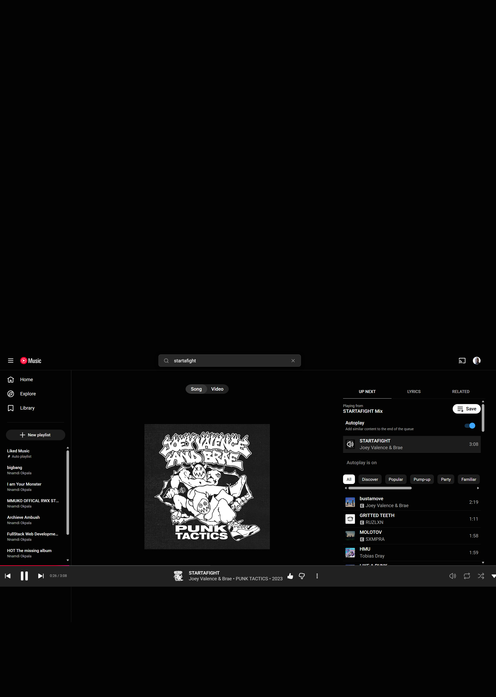
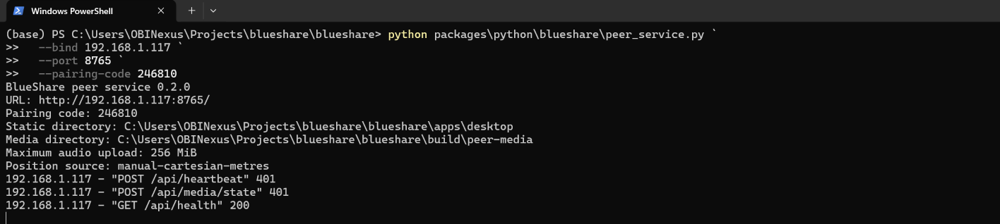
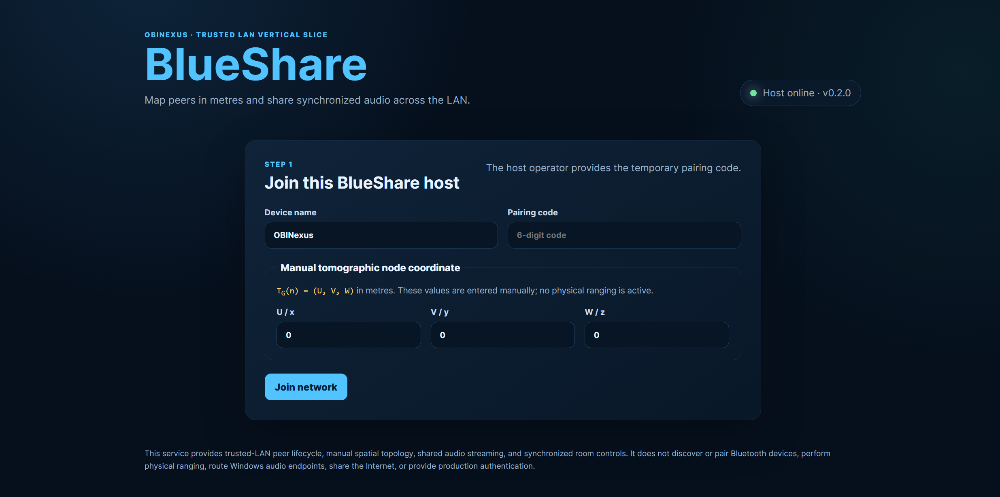
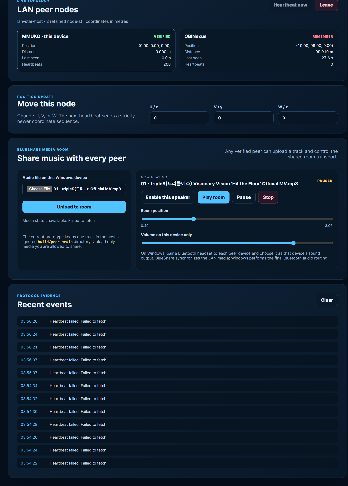

# BlueShare - Sharing Moments Matters

## A first-person user story and Windows guide

**By Nnamdi Michael Okpala**  
**OBINexus Computing**  
**Contact:** [okpalan@protonmail.com](mailto:okpalan@protonmail.com)  
**Project:** BlueShare 0.2.0

> I created BlueShare because listening together should feel like a shared
> moment, even when every person uses a different laptop, speaker, or headset.

## Why I built BlueShare

For me, BlueShare is about more than pressing play. It is about creating a
small, trusted network where devices can find one another as named peers, keep
their connection alive, understand their relative position, and participate in
one shared media room.

My guiding phrase is **Sharing Moments Matters**.

Today, BlueShare runs as a Windows-hosted trusted-LAN service. One Windows
laptop starts the host, and other devices on the same Wi-Fi join through a web
browser. Every joined peer receives its own MMUKO lifecycle state and manual
three-dimensional coordinate:

```text
T_G(n) = (U, V, W)
```

The coordinates are measured in metres. They are currently entered by the
user, so BlueShare does not yet claim that Wi-Fi or Bluetooth has physically
measured the distance.

Once joined, people can upload one audio file to the room and interact with it
together. Any active peer can play, pause, seek, or stop. Each person controls
their own volume, and Windows sends that browser's audio to the locally selected
Bluetooth headset or speaker.

## What BlueShare 0.2.0 does today

- Joins multiple browsers to one trusted Windows LAN host.
- Uses a temporary pairing code and private session tokens.
- Tracks peers as `ACTIVE`, `VERIFIED`, `REMEMBER`, or `LEFT`.
- Recovers a retained peer after a temporary heartbeat interruption.
- Displays manual `(U,V,W)` coordinates and symmetric distances in metres.
- Accepts one user-selected audio file, up to 256 MiB by default.
- Streams that file with HTTP byte-range support for buffering and seeking.
- Synchronizes play, pause, seek, and stop through a shared host clock.
- Lets every verified peer interact with the room transport.
- Keeps volume local to each device.

BlueShare 0.2.0 is a working prototype, not a production music platform. It
uses unencrypted HTTP, in-memory peer sessions, and a trusted local network.

## What a YouTube Music URL means in BlueShare

Here is the example provider link I tested as a sharing reference:

[Open the example YouTube Music track](https://music.youtube.com/watch?v=TgOu00Mf3kI&list=OLAK5uy_mgryJlILDE846ev_oLUtqPgtKuA92zdBs)



*Figure 1. A provider-hosted track is a useful link to share, but the page URL
is not a raw audio file.*

I need to be precise about this boundary. BlueShare cannot take a YouTube Music
page URL, extract its protected audio, and rebroadcast it as if it were a local
MP3. The provider controls authentication, licensing, advertising, encryption,
and playback. A normal `music.youtube.com/watch` address is an HTML application,
not a direct `audio/*` resource.

For BlueShare 0.2.0, I use provider links in this lawful way:

1. I share the provider URL with the people in my room.
2. Each person opens the link using their own browser and provider account.
3. I do not download, extract, proxy, or redistribute the provider stream.
4. If I want BlueShare-synchronized playback, I upload an audio file that I own
   or have permission to share.

A future provider adapter can synchronize independent, authorized provider
players by using an official provider API. That design should send control
intent, such as play or seek, rather than copying protected media through the
BlueShare host.

## How I start BlueShare on Windows

I connect every device to the same trusted Wi-Fi. On the host laptop, I open
Windows PowerShell and run:

```powershell
Set-Location C:\Users\OBINexus\Projects\blueshare\blueshare

python packages\python\blueshare\peer_service.py `
  --bind 192.168.1.117 `
  --port 8765 `
  --pairing-code 246810 `
  --max-media-mb 256
```

I replace `192.168.1.117` if `ipconfig` shows a different Wi-Fi IPv4 address. I
do not bind to `127.0.0.1` when another device must join because that address is
available only inside the host laptop.



*Figure 2. The host prints the URL, pairing code, media directory, upload limit,
and coordinate source. HTTP 401 after a restart usually means a browser is
still presenting an expired session token and must rejoin.*

I keep this PowerShell window open. If Windows Defender Firewall asks for
permission, I allow Python only on the trusted network profile I am using.

## How I join each device

On the host and every other Windows device, I open:

```text
http://192.168.1.117:8765/
```

Then I complete these steps:

1. I enter a distinct device name, such as `MMUKO`, `OBINexus`, or
   `Living-Room-Laptop`.
2. I enter the temporary pairing code shown by the host.
3. I enter the device's manual `(U,V,W)` coordinate in metres.
4. I select **Join network**.
5. I wait until the device reaches `VERIFIED`.



*Figure 3. The first screen joins a named peer and assigns its manual spatial
coordinate.*

The first heartbeat verifies the session. If a browser sleeps or briefly loses
the network, the host may retain that peer as `REMEMBER`. A valid heartbeat can
recover it. If the service has restarted, I enter the pairing code again so the
browser receives a new session token.

## How I connect Bluetooth audio

BlueShare synchronizes media over the LAN. Windows performs the final Bluetooth
audio routing. On every listening Windows device, I:

1. Open **Settings > Bluetooth & devices**.
2. Select **Add device > Bluetooth**.
3. Pair one headset or speaker to that device.
4. Open **Settings > System > Sound**.
5. Choose the paired device as the sound output.
6. Return to BlueShare and select **Enable this speaker**.
7. Set the local volume to a safe starting level.

This design lets several people listen through several Bluetooth headsets when
each headset is attached to its own BlueShare peer device. BlueShare does not
yet force one Windows Bluetooth radio to drive several headset endpoints at
once.

## How I share an audio file

After every device is joined and its speaker is enabled, I use the media room:

1. I select **Choose File**.
2. I choose an audio file that I own or have permission to share.
3. I select **Upload to room**.
4. I wait for the track name and `READY` or `PAUSED` state to appear.
5. I select **Play room**.
6. Any verified participant may then play, pause, seek, or stop.
7. Each participant adjusts **Volume on this device only** for their own
   headset.

The host stores the current track under the ignored `build/peer-media/`
directory. Uploading another track replaces the current room track. The audio
endpoint supports byte ranges so browsers can seek without downloading the
entire file before playback begins.



*Figure 4. The media room shows the selected track, shared transport, local
volume, peer topology, and protocol evidence. In this captured moment the host
became unreachable, which correctly produced `Failed to fetch` events.*

## How I recover from the errors shown in the screenshots

### HTTP 401 in PowerShell

An HTTP 401 immediately after I restart BlueShare usually means an open browser
still holds the previous process's session token. Because the service registry
is in memory, a restart creates a new session universe.

I fix it by refreshing the page, returning to the join form, entering the
current pairing code, and joining again.

### `Heartbeat failed: Failed to fetch`

This means the browser could not reach the BlueShare host. It is a transport
failure, not proof that the audio format is invalid. I check:

1. The host PowerShell window is still running.
2. Both devices are still on the same Wi-Fi.
3. The browser address uses the host's current Wi-Fi IPv4 address.
4. Port `8765` is not blocked by Windows Defender Firewall.
5. `http://192.168.1.117:8765/api/health` opens from the other device.
6. I rejoin if the service was restarted.

### A peer shows `REMEMBER`

`REMEMBER` means the host has retained the node but its heartbeat exceeded the
timeout. I bring the browser tab to the foreground or reconnect the device. A
valid heartbeat changes it back to `ACTIVE`, then `VERIFIED`.

### The room is playing but one headset is silent

I select **Enable this speaker** on that peer, confirm the correct Windows sound
output, check the local BlueShare volume, and confirm the browser tab is not
muted. Browsers require a local user action before remote playback is allowed.

## How people can share BlueShare

I want people to share BlueShare as an invitation to a trusted local moment:

1. One person hosts the service.
2. The host shares the LAN URL and temporary pairing code only with the people
   present.
3. Each person joins with a recognizable device name.
4. Each person connects their own speaker or headset.
5. The group shares media it has the right to play.
6. Every verified peer can interact with the room, not just the host.
7. When the moment ends, the host presses `Ctrl+C` and the temporary session is
   gone.

People can also share a provider link, such as the YouTube Music example, but
each listener must use the provider's authorized playback. BlueShare should not
be used to bypass access controls, copy protected streams, or distribute media
without permission.

## What I want to build next

My next steps for BlueShare are:

- official provider-link adapters that synchronize authorized players;
- encrypted HTTPS transport and persistent device identity;
- explicit host and participant media permissions;
- better drift measurement for Bluetooth output latency;
- Windows service installation and a packaged desktop shell;
- Android-compatible peers;
- physical ranging adapters that replace manual coordinates; and
- exportable media-room and movement evidence reports.

The long-term idea remains simple: a network should understand the people and
devices participating in a moment, preserve consent, recover safely from
failure, and make sharing feel direct.

## Quick reference

| Item | Current value |
| --- | --- |
| Host URL | `http://HOST_IP:8765/` |
| Example host | `http://192.168.1.117:8765/` |
| Service | `packages/python/blueshare/peer_service.py` |
| Current protocol | BlueShare trusted-LAN peer and media protocol 0.2 |
| Current media source | User-selected local audio file |
| Provider URL support | Link handoff only; no extraction or rebroadcasting |
| Peer media controls | Play, pause, seek, stop |
| Volume | Local to each device |
| Bluetooth | Paired and routed by Windows on each peer |
| Security boundary | Trusted LAN, temporary code, unencrypted HTTP |

## Closing

I am Nnamdi Michael Okpala, creator of BlueShare for OBINexus Computing. I am
building this project around a belief that technology should help people share
moments while preserving clear boundaries, consent, and control.

**BlueShare - Sharing Moments Matters.**

Contact me at [okpalan@protonmail.com](mailto:okpalan@protonmail.com).
